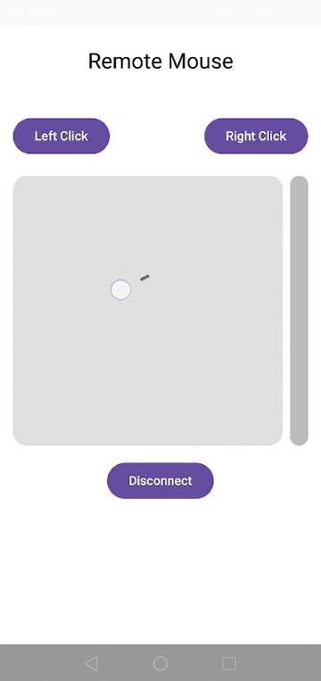
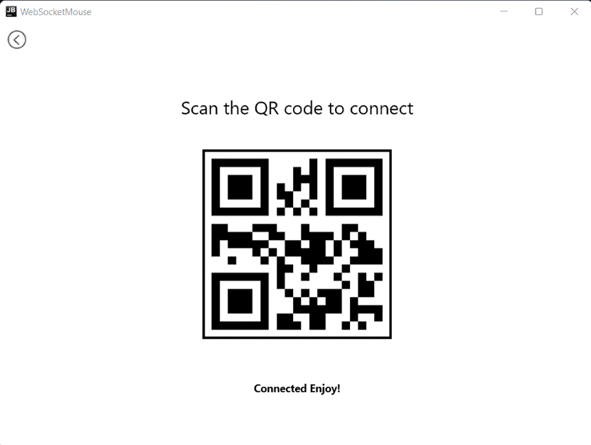

# WebSocketMouse

# 🖱️ Remote Mouse (Compose Multiplatform + WebSocket)

A simple Kotlin Multiplatform project to use your Android phone as a **remote mouse** for your desktop.

Built using **Jetpack Compose Multiplatform** and **WebSocket** for real-time interaction.

---

## 📦 How It Works

- **Desktop app** starts a WebSocket server on port `9090` and displays a QR code with its IP.
- **Android app** scans the QR code and connects to the server.
- Once connected, the Android app acts as a touchpad:
  - Move cursor
  - Scroll
  - Left & right click
  - Double-tap to click

---

## ⚠️ Notes

- Both devices must be on the **same Wi-Fi network**
- If connection fails, try restarting your **router**

---

## 📸 Screenshots

### Android App

### Desktop App

---

## 🤝 Contributing

Contributions, feedback, and suggestions are always welcome!  
If you'd like to improve this project or add new features, feel free to open an issue or submit a pull request.

Let's build something cool together! 🚀

---

